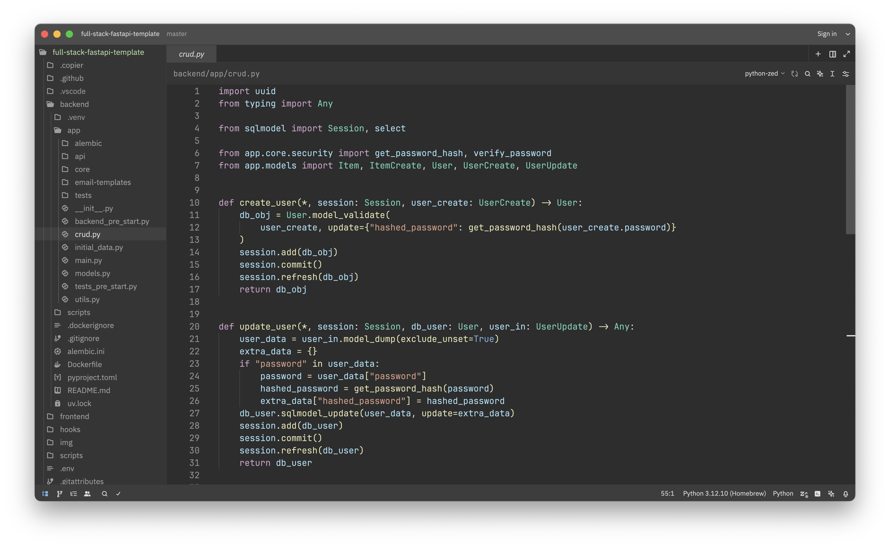

# Azutiku theme for Zed

A dark theme for [Zed](https://zed.dev) with a gentle, soft palette that's easy on the eyes.

## Manual install

- Copy `themes/azutiku.json` from this repo into `~/.config/zed/themes`.
- Select the `Azutiku Dark` theme (Settings -> Select Theme).
